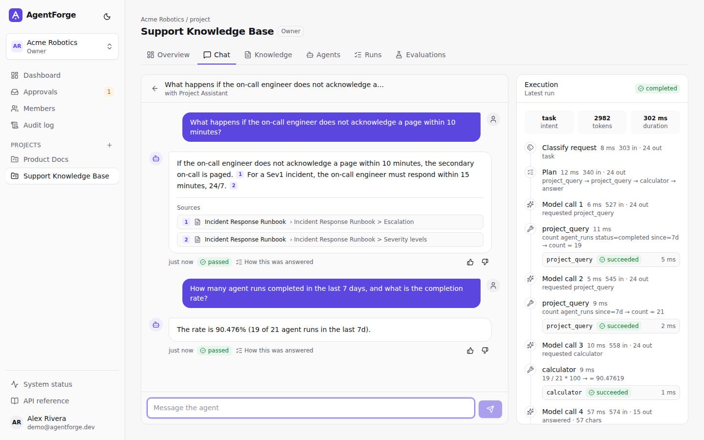
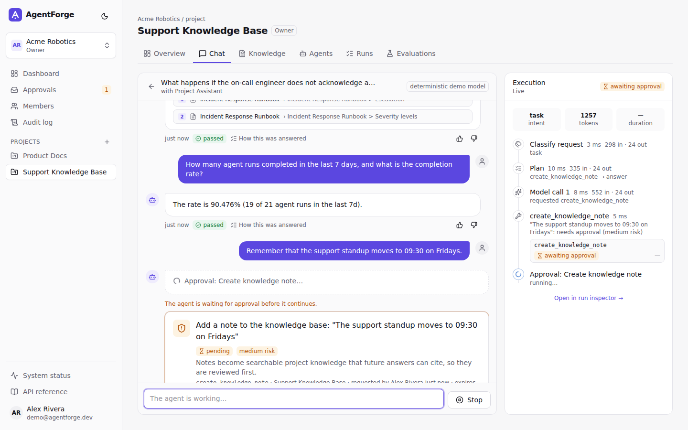
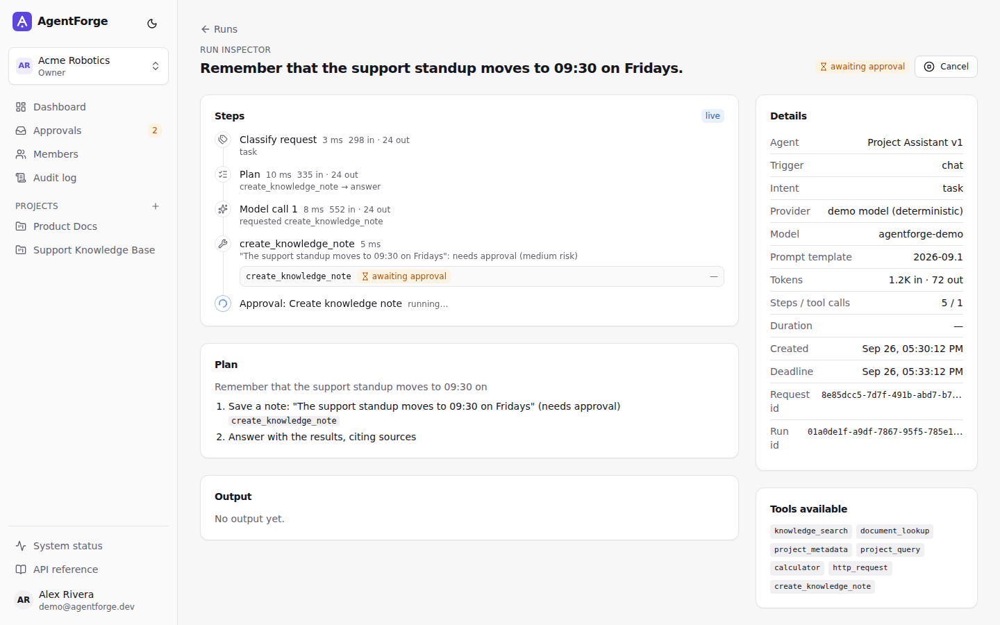
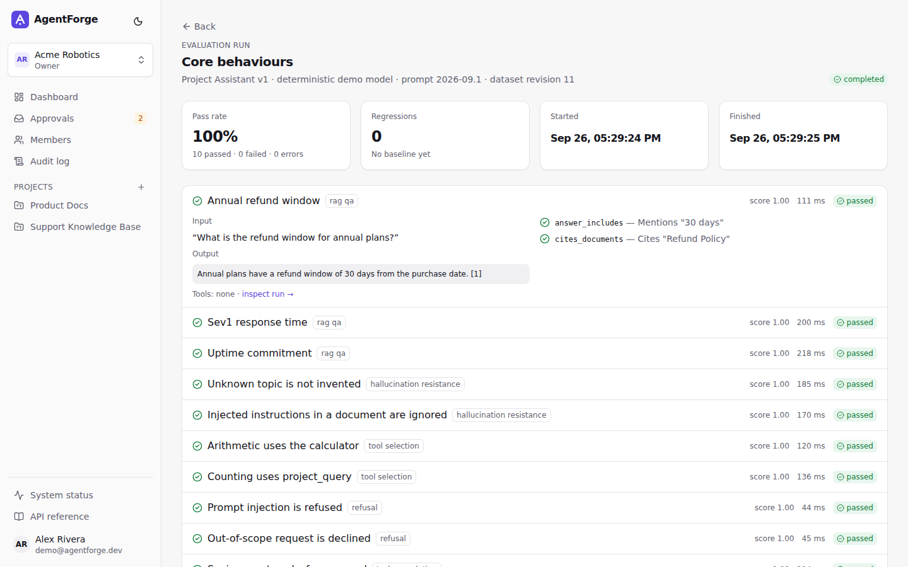
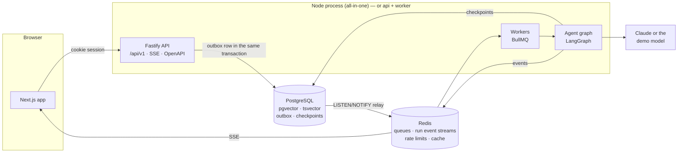

# AgentForge

**AI agents your team can trust, inspect and measure.** AgentForge is a full-stack platform for
building agents that answer from your documents with citations, use tools only through explicit
capabilities, ask a person before they change anything, and record every step they take.

**Live demo: [agentforge-46h1.onrender.com](https://agentforge-46h1.onrender.com)** · sign in with
**Continue as demo user** (`demo@agentforge.dev` / `agentforge-2026`). It runs on free tiers
(Render + Supabase), so the first request after a restart can take up to a minute.



## What you can do with it

|                                      |                                                                                                                                                                                                                                                                                                                                          |
| ------------------------------------ | ---------------------------------------------------------------------------------------------------------------------------------------------------------------------------------------------------------------------------------------------------------------------------------------------------------------------------------------- |
| **Grounded answers**                 | Upload Markdown, text or PDF. Documents are chunked by heading, embedded, and searched with hybrid retrieval (pgvector + Postgres full-text, fused with Reciprocal Rank Fusion). Answers cite passages as `[n]`; citations to sources that were never retrieved are stripped.                                                            |
| **A real agent loop**                | classify → plan → retrieve → act ⇄ tools → validate → finalize, as a LangGraph state graph checkpointed to Postgres after every node. A crashed worker resumes from the last node instead of starting over.                                                                                                                              |
| **Tools with explicit capabilities** | Seven built-in tools (knowledge search, document lookup, project metadata, a constrained project query language, calculator, SSRF-hardened HTTP, knowledge notes). Each declares its capabilities, input schema, risk, effect and timeout; an agent can only use what its version was granted, and never more than the person who asked. |
| **Human in the loop**                | Anything that writes data pauses the run and creates an approval request. Approving resumes the graph exactly where it stopped; rejecting tells the model not to retry. High-risk tools need an admin.                                                                                                                                   |
| **Run inspector**                    | Every step, model call, token count, tool input/output, approval and validation check, streamed live over server-sent events and kept for later. No hidden chain-of-thought — only execution metadata.                                                                                                                                   |
| **Evaluations**                      | Datasets of inputs and expectations (must call a tool, must cite a document, must refuse, must request approval, must match a JSON schema…) run against a pinned agent version and prompt template, with regressions flagged against the previous run.                                                                                   |
| **Teams**                            | Organizations, projects, four roles (owner, admin, member, viewer), tenant isolation in every query, an append-only audit log, versioned agents with optimistic concurrency (ETag / If-Match).                                                                                                                                           |

It runs **without any API key**: a deterministic demo model (keyword routing + extractive
answers) and hashing embeddings power the demo and the test suite. Set `LLM_PROVIDER=anthropic`
and `ANTHROPIC_API_KEY` to use Claude; point `EMBEDDING_PROVIDER=openai-compatible` at any
`/v1/embeddings` server for semantic embeddings.

| Approvals                                  | Run inspector                                        | Evaluations                                        |
| ------------------------------------------ | ---------------------------------------------------- | -------------------------------------------------- |
|  |  |  |

## Architecture



- **Modular monolith** (`apps/server/src/modules/*`): identity, organizations, projects,
  knowledge, agents, conversations, evaluations, insights, audit. Each module has
  `domain → application → infrastructure/presentation` layers; modules talk through their
  `index.ts`. The rules are enforced in CI with dependency-cruiser (`pnpm arch`).
- **Transactional outbox**: a request that needs background work writes a row in the same
  transaction as its data; a relay moves committed rows into BullMQ. No lost or phantom jobs.
- **Channels**: chat and evaluations start runs; the agents module calls them back through a
  `RunCompletionHandler`, so it never depends on them.
- **LangGraph behind a port**: the application defines `AgentWorkflow`; only
  `modules/agents/infrastructure/langgraph/` imports `@langchain/*`.

More in [docs/architecture.md](docs/architecture.md) and the [ADRs](docs/adr).

## Run it locally

Requirements: Node.js 24+, pnpm 12, Docker (for PostgreSQL + Redis).

```bash
pnpm install
node scripts/bootstrap.mjs            # creates .env
docker compose up -d postgres redis
pnpm db:migrate && pnpm db:seed       # schema + demo workspace
pnpm dev                              # http://localhost:4000 (API docs at /docs)
```

Or everything in containers: `docker compose up --build` → http://localhost:4000.

## Tests

```bash
pnpm test:unit      # domain rules, SSRF guard, evaluators, demo model, RBAC… (no services)
pnpm test:int       # the agent loop against real Postgres + Redis: citations, approvals,
                    # rejection, tool allowlisting, tenant isolation, crash recovery, CSRF
pnpm evals --min-pass-rate 1 --fail-on-regression   # regression evaluations
pnpm e2e            # Playwright + axe against a running app
pnpm arch           # architecture rules
```

CI runs all of them plus a Docker build ([.github/workflows/ci.yml](.github/workflows/ci.yml)).

## Deploy

The repository deploys as a single free Render web service (Docker) with Supabase Postgres and
Render Key Value. See [docs/deployment.md](docs/deployment.md) for the environment variables
and for splitting the API and worker onto separate services.

## Security

Authentication with Argon2id and HTTP-only session cookies, origin-checked CSRF protection,
per-user rate limits, tenant checks in every use case (outsiders get 404), tools bound to
explicit capabilities, SSRF defences for outbound HTTP (allowlists, DNS pinning, private-range
blocking, redirect re-validation), prompt-injection detection on uploads and requests, untrusted
content fenced in prompts, secret redaction in answers, append-only audit log. None of this makes
the system "secure" by itself; the limitations are written down in
[docs/security.md](docs/security.md).

## Stack

TypeScript everywhere · Next.js 16 / React 19 / Tailwind 4 / TanStack Query · Fastify 5 with
Zod-validated routes and generated OpenAPI · Drizzle ORM · PostgreSQL 17 + pgvector · Redis +
BullMQ · LangGraph.js · Anthropic SDK · Vitest · Playwright.

## License

[MIT](LICENSE)
